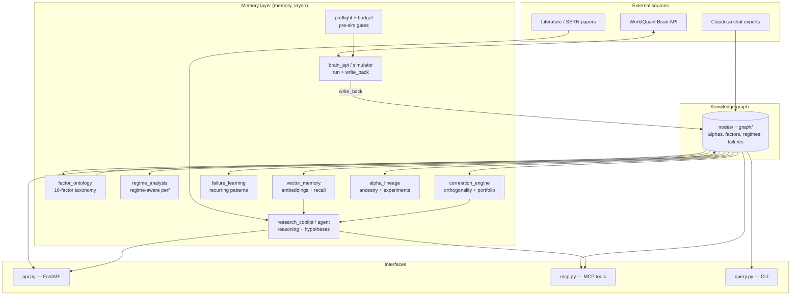

# WQ Brain Institutional Research Intelligence Platform

## Version 0.3.0 - AI-Native Quant Research Operating System

This document describes the architecture of the evolved WQ Brain Knowledge Graph - now an institutional-grade AI-native quant research operating system.

---

## Architecture Overview

### System diagram



### Core Components

```
memory_layer/
├── api.py                 # FastAPI server (v0.3.0)
├── institutional_api.py   # Institutional research endpoints
├── structure.py           # Graph metadata extraction
├── embed.py               # Sentence-transformer embeddings
├── ingest.py              # Graph -> Qdrant pipeline
├── retrieve.py            # Hybrid vector + metadata retrieval
├── config.py              # Configuration management

# Institutional Features
├── factor_ontology.py     # 16-factor canonical taxonomy
├── regime_analysis.py      # Regime-aware performance tracking
├── failure_learning.py    # Recurring pattern detection
├── vector_memory.py       # Persistent semantic memory
├── correlation_engine.py  # Pairwise correlations + portfolio
├── research_copilot.py    # Institutional reasoning assistant
├── nl_query.py           # Natural language query parser
├── recommendation_engine.py # Research recommendations

# NEW: v0.3.0 Features
├── alpha_lineage.py      # Alpha ancestry and experiment evolution
└── research_agent.py     # Autonomous research agents
```

---

## New Features

### A. Factor Ontology Engine

**16 Canonical Factor Families:**
- Quality, Value, Momentum, Reversal, Liquidity, Volatility
- Growth, Defensive, Carry, Recovery, Distress
- Positioning, Flow-Based, Statistical Arbitrage
- Macro-Sensitive, Sector-Sensitive

**Relationships:**
- `BELONGS_TO_FACTOR` - Alpha belongs to factor family
- `HAS_EXPOSURE` - Detected factor exposure with confidence
- `CONFLICTS_WITH` - Conflicting factor exposures
- `COMPLEMENTS` - Complementary factors
- `DERIVED_FROM` - Factor evolution lineage

**API:**
```bash
POST /factor/classify
  Body: {alpha_id, expression, datafields, operators, concepts}
  Returns: factor_exposures with confidence scores
```

### B. Regime Analysis Engine

**Supported Regimes:**
- crisis, recovery, inflation, deflation
- growth_leadership, value_rotation
- volatility_spike, liquidity_stress
- ai_speculative, risk_on, risk_off

**Features:**
- Yearly regime performance tracking
- Regime sensitivity metrics (crisis convexity, macro dependence)
- Regime-specific alpha discovery

**API:**
```bash
GET /regime/performance/{alpha_id}
GET /regime/alphas/{regime}?min_sharpe=0.5
POST /regime/dependencies
```

### C. Vector Memory System

**Memory Types:**
- `ALPHA_EXPRESSION` - Alpha formula embeddings
- `RESEARCH_NOTE` - Research notes
- `SIMULATION_RESULT` - Backtest results
- `HYPOTHESIS` - Research hypotheses
- `FAILURE_ANALYSIS` - Failure case studies
- `MACRO_INTERPRETATION` - Macro analysis

**API:**
```bash
POST /memory/semantic
GET /memory/semantic/search?query=...&k=5
```

### D. Failure-Mode Learning

**Detected Patterns:**
- high_turnover, low_fitness, over_neutralization
- momentum_reversal_conflict, excessive_smoothing
- hidden_beta, low_uniqueness, concentration_risk
- regime_collapse, sector_overexposure, datafield_mismatch

**API:**
```bash
POST /failure/learning
GET /failure/warnings
GET /failure/common
```

### E. Correlation + Portfolio Engine

**Features:**
- Pairwise alpha correlations
- Factor overlap analysis
- Orthogonality scoring
- Portfolio optimization

**API:**
```bash
POST /correlation/register
GET /correlation/pair/{alpha1}/{alpha2}
GET /correlation/orthogonal/{alpha_id}
POST /correlation/portfolio
```

### F. AI Research Copilot

**Capabilities:**
- Explain alpha failures (like senior quant PM)
- Detect hidden factor exposures
- Identify factor conflicts
- Suggest orthogonal sleeves
- Infer economic meaning
- Detect overfitting

**API:**
```bash
POST /copilot/hidden-exposures
POST /copilot/factor-conflicts
POST /copilot/economic-meaning
POST /copilot/overfitting
```

### G. Natural Language Queries

**Supported Queries:**
- "Find recovery-quality alphas"
- "Which operators improve crisis performance?"
- "Which factor families failed during inflation?"
- "Find orthogonal sleeves for this alpha"
- "Why did this alpha collapse in 2020?"

**API:**
```bash
POST /query/nl
  Body: {query: "Find recovery-quality alphas"}
```

### H. Recommendation Engine

**Features:**
- Unexplored factor combination suggestions
- Missing macro dimension identification
- Orthogonal sleeve recommendations
- Exploration coverage tracking

**API:**
```bash
GET /recommend/coverage
GET /recommend/factors?used_factors=...,used_datafields=...
GET /recommend/roadmap
```

---

## I. Alpha Lineage System

**Features:**
- Track alpha ancestry and derivation chains
- Record modifications (parameter changes, operator substitutions, factor evolution)
- Branch management for experiment tracking
- Alpha comparison and tree visualization

**API:**
```bash
POST /lineage/register
GET /lineage/{alpha_id}
GET /lineage/compare/{alpha1}/{alpha2}
GET /lineage/tree/{root_alpha_id}
GET /lineage/stats
```

---

## J. Autonomous Research Agent

**Capabilities:**
- Generate research hypotheses
- Analyze failed alphas
- Find orthogonal sleeves
- Detect research gaps
- Maintain research diversity

**API:**
```bash
POST /agent/hypothesis
POST /agent/analyze-failure/{alpha_id}
GET /agent/orthogonal/{alpha_id}
GET /agent/gaps
GET /agent/diversity
GET /agent/stats
```

---

## MCP Tools (v0.3.0)

New institutional MCP tools:
```json
{
  "classify_alpha_factors": "Classify alpha into factor families",
  "get_regime_performance": "Get regime breakdown for alpha",
  "find_regime_alphas": "Find alphas by regime",
  "explain_alpha_failure": "Institutional-grade failure explanation",
  "find_orthogonal_alphas": "Find uncorrelated alternatives",
  "detect_hidden_exposures": "Detect hidden factor exposures",
  "natural_language_query": "Process NL research queries",
  "get_exploration_coverage": "Research exploration stats",
  "suggest_factor_combinations": "Suggest unexplored factors",

  "register_alpha_lineage": "Register alpha with lineage tracking",
  "get_alpha_lineage": "Get complete lineage for an alpha",
  "compare_alpha_lineage": "Compare two alphas in same lineage",
  "get_experiment_tree": "Get full experiment tree",
  "get_lineage_stats": "Get lineage tracking statistics",

  "generate_hypothesis": "Generate new research hypothesis",
  "analyze_failed_alpha_research": "Analyze failed alpha and propose fixes",
  "find_orthogonal_sleeve": "Find orthogonal sleeve for alpha",
  "detect_research_gaps": "Detect unexplored research areas",
  "maintain_research_diversity": "Analyze research diversity",
  "get_agent_stats": "Get research agent statistics"
}
```

---

## Migration

To migrate existing data to institutional features:

```bash
python memory_layer/migrate_institutional.py
```

This will:
1. Classify all existing alphas into factor families
2. Register alphas for correlation analysis
3. Learn from existing failures
4. Create semantic memories for top alphas

---

## Visualization

New dashboard: `graph/institutional_dashboard.html`

Features:
- Alpha graph explorer
- Factor cluster visualization
- Regime heatmaps
- Correlation matrices
- Alpha genealogy trees

---

## Dependencies

Core (unchanged):
- qdrant-client>=1.18.0
- sentence-transformers>=2.2.0
- numpy>=1.24.0
- fastapi>=0.104.0

New (added):
- None additional required (uses existing packages)

---

## Design Philosophy

This system evolves from:
"experiment tracker" → "persistent institutional quant research intelligence system"

Think:
- WorldQuant Brain internal memory
- Two Sigma research graph
- Renaissance-style factor ontology
- AI-native quant operating system

The system:
- Remembers all research
- Understands factor relationships
- Learns from failures
- Discovers orthogonal alpha sleeves
- Assists institutional-style portfolio construction
- Becomes progressively smarter over time